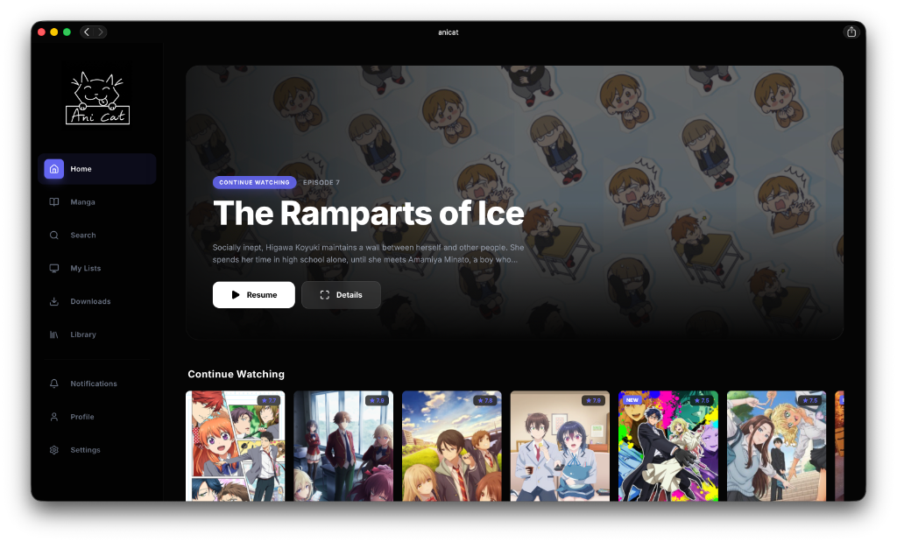

# Anicat

Anicat is a specialized media companion for macOS, designed to streamline anime and manga management. It provides a centralized dashboard to stream content, track progress via AniList, and manage local reading with a minimalist, performance-first architecture.

Anicat is built on the foundations of the [Viu](https://github.com/viu-media/viu) project, refined for a native macOS experience with a focus on background persistence and ease of use.



## Installation (macOS)

To install Anicat, run the following command in your terminal:

```bash
curl -fsSL https://raw.githubusercontent.com/bonkedbythonk/anicat/main/scripts/install_macos.sh | bash
```

This script downloads the latest release, installs it to your Applications folder, and configures the necessary security permissions.

## Features

- **Premium macOS Experience**: Native-style squircle icon and glassmorphism UI.
- **Sync Everything**: Automatic AniList synchronization for both anime and manga.
- **Seamless Playback**: Integrated player support (AnimePahe) and high-quality reader (MangaKatana).
- **Background Service**: Runs as a silent service on port 13370.
- **Cross-Platform Ready**: Built with Tauri v2 for maximum performance and security.

## Architecture

Anicat consists of a FastAPI backend service and a Next.js frontend, bundled together as a native application using Tauri. The backend handles media scraping, progress tracking, and local state, while the frontend provides a responsive dashboard for media discovery and interaction.
